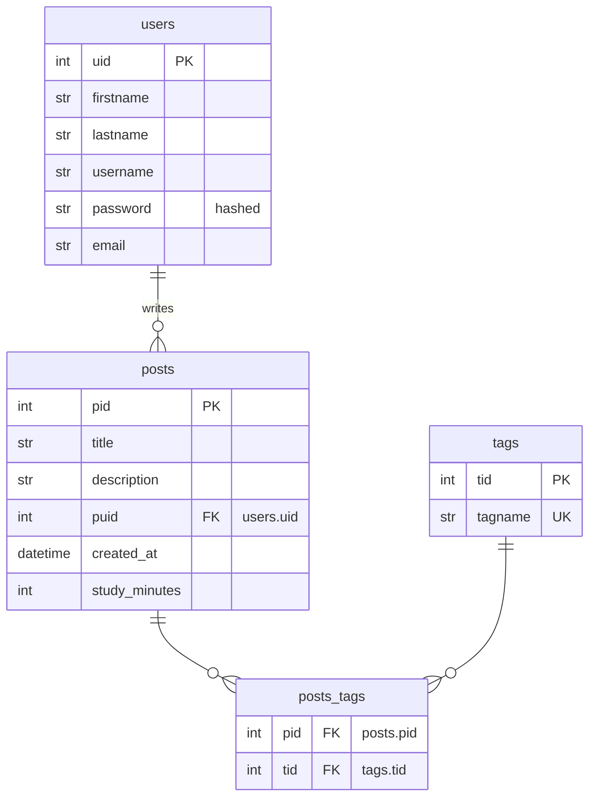

# Tables_LearnLogger

```mermaid
erDiagram
    users ||--o{ posts : "writes"
    posts ||--o{ posts_tags : ""
    tags  ||--o{ posts_tags : ""

users {
    int uid PK
    str firstname
    str lastname
    str username
    str password "hashed"
    str email
}

posts {
    int pid PK
    str title
    str description
    int puid FK "users.uid"
    datetime created_at
    int study_minutes
}

tags {
    int tid PK
    str tagname UK
}

posts_tags {
    int pid FK "posts.pid"
    int tid FK "tags.tid"
}

```
